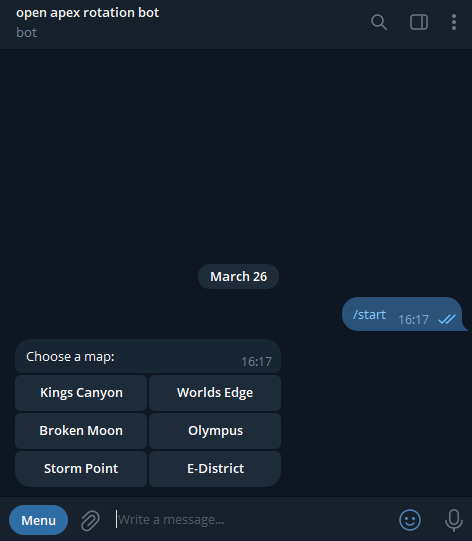
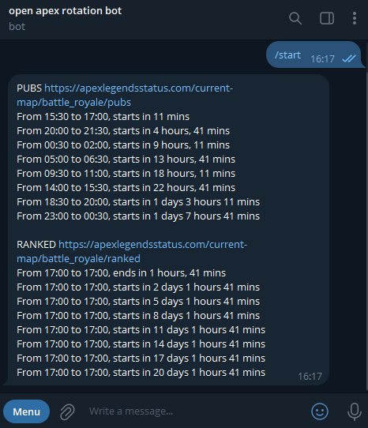

# Apex Legends Map Rotation telegram bot

This bot is designed to fetch the current map rotation schedule for Apex Legends.

🤡: I'm not into python.. just can read and maybe debug some stuff. Therefore, instead of relying on official APIs, the bot uses a web scraping approach to extract data directly from the Apex Legends Status website. This method allows the bot to bypass potential API rate limits and shall work until site owners will change some website output..

---

## Features

1. **Private Chat Functionality:**
   - Start the bot with the `/start` command.
   - Displays a set of buttons for selecting maps.
   - Fetches and displays the schedule for the selected map.

2. **Group Chat Functionality:**
   - Responds only to commands or button interactions.
   - Does not send unsolicited messages in group chats.

3. **Map Selection:**
   - Provides buttons for the following maps:
     - Kings Canyon
     - Worlds Edge
     - Broken Moon
     - Olympus
     - Storm Point
     - E-District

4. **Schedule Display:**
   - Fetches data from the following URLs:
     - `PUBS_URL`: `${BASE_URL}/pubs`
     - `RANKED_URL`: `${BASE_URL}/ranked`
   - Parses HTML to extract and display the schedule in a readable format.

5. **Error Handling:**
   - Notifies the user if data fetching fails.
   - Displays an error message for invalid map selections.

6. **Performance:**
   - Asynchronous design ensures responsiveness and scalability.
   - Handles multiple users simultaneously.

---


## Usage
1. Message or add to group [@openapexrotation_bot](https://t.me/openapexrotation_bot)

### Private Chat
1. Start the bot by sending `/start`.
2. Click on a map button (e.g., "Kings Canyon").
3. The bot will fetch and display the schedule for the selected map.

### Group Chat
1. Add the bot to a group.
2. Use the `/schedule` command to display the map selection menu.
3. Click on a map button to get the schedule.

---

## Example Output



### Private Chat
```
PUBS https://apexlegendsstatus.com/current-map/battle_royale/pubs
PUBS on Kings Canyon From 21:00 to 22:30, starts in 39 mins
PUBS on Kings Canyon From 01:30 to 03:00, starts in 5 hours, 9 mins
...
```

### Group Chat
```
User: /schedule
Bot: [Displays map selection buttons]
User clicks "Worlds Edge"
Bot: [Displays schedule for Worlds Edge]
```

---

## Technical Details

1. **Libraries Used:**
   - `python-telegram-bot`: For Telegram bot functionality.
   - `aiohttp`: For asynchronous HTTP requests.
   - `beautifulsoup4`: For HTML parsing.

2. **Asynchronous Design:**
   - All network requests and bot interactions are asynchronous for better performance.

3. **Environment Variables:**
   - `TELEGRAM_BOT_TOKEN`: Telegram bot token.
   - `BASE_URL`: Base URL for fetching map rotation data.

4. **Error Handling:**
   - If a URL fetch fails: "Error fetching schedule. Please try again later."
   - If an invalid map is selected: "Invalid map selection. Please choose a valid map."

---

## Installation

1. Clone the repository:
   ```bash
   git clone https://github.com/your-repo/open-apex-rotation-bot.git
   cd open-apex-rotation-bot
   ```

2. Install dependencies:
   ```bash
   cd src
   pip install -r requirements.txt
   ```

3. Set up environment variables:
   - `TELEGRAM_BOT_TOKEN`: Your Telegram bot token.
   - `BASE_URL` (optional): Base URL for fetching map rotation data (default: `https://apexlegendsstatus.com/current-map/battle_royale`).

   Example variable:
   ```env
   TELEGRAM_BOT_TOKEN=your_telegram_bot_token
   ```

4. Run the bot:
   ```bash
   python main-tg.py
   ```

---

## Deployment

1. **Container Deployment:**
   - Build the Docker/Podman image:
     ```bash
     cp src/main-tg.py src/requirements.txt Docker/
     cd Docker
     podman build -t open-apex-rotation-bot .
     ```
   - Run the container:
     ```bash
     podman run -d -e TELEGRAM_BOT_TOKEN=$TOKEN open-apex-rotation-bot
     ```

2. **Manual Deployment:**
   - Follow the installation steps above.
   - Run the bot using `python main-tg.py`.

---

## Contributing

Contributions are welcome! Please open an issue or submit a pull request for any improvements or bug fixes.

---

## License

This project is licensed under the MIT License. See the [LICENSE](LICENSE) file for details.
